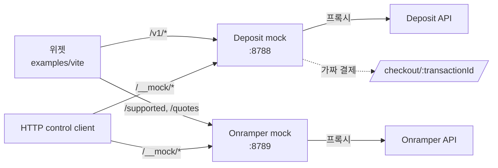
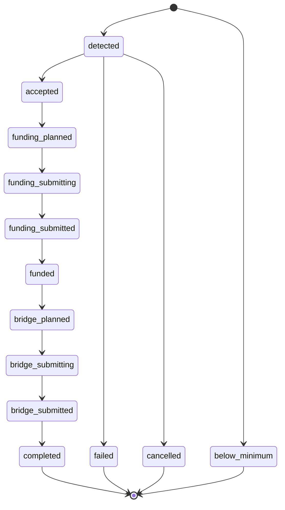

# Mock API 설계

이 문서는 mock의 architecture, endpoint, 상태 machine, fidelity limit를 정의한다. 실행과 사용 절차는 [README.md](./README.md)에 있다.

## 근거

| 소스                                                                  | 용도                                 |
| --------------------------------------------------------------------- | ------------------------------------ |
| `packages/interwovenkit-react/src/pages/deposit/docs/API_DEPOSIT.md`  | Deposit API HTTP 규격의 1차 근거     |
| `packages/interwovenkit-react/src/pages/deposit/docs/API_ONRAMPER.md` | Onramper 연동과 checkout 프록시 규격 |
| 백엔드 repo `~/work/initia/deposit`                                   | 상태 전이, validation, 오류 구현     |
| `pages/deposit/data/*`, `pages/deposit/onramp/data/*`                 | 프론트 boundary guard와 실제 request |

## 아키텍처



두 서버는 Hono 독립 서버다. 실제 API와 같은 path와 입출력을 사용하며 위젯은 base URL만 바꾼다. read-only API는 프록시하고 실제 자금 없이 결과가 생기지 않는 deposit과 checkout만 시뮬레이션한다. 상태는 Deposit mock의 in-memory 저장소에만 있다.

`examples/vite`는 Deposit mock URL만 env로 주입한다. Onramper mock 경로는 `InterwovenKitProvider`의 `onramperApiUrl`을 직접 override한 test host에서만 사용한다. Override가 없으면 MAINNET의 Deposit API read proxy를 사용한다.

CORS는 `Access-Control-Allow-Origin: *`, method `GET, POST, OPTIONS`, header `Authorization, Content-Type, X-Correlation-ID, X-Request-ID`를 허용한다. Control API용 `PATCH`도 추가한다. Deposit mock의 비 2xx 응답은 `{ "error": "<message>" }`이며 프록시 응답은 업스트림 status와 body를 유지한다. Onramper 응답도 그대로 전달한다.

## 엔드포인트

### Onramper mock

무상태 catch-all 프록시다. 대표 request는 다음과 같다.

- `GET /supported?type=buy`
- `GET /supported/payment-types/{source}?destination=&type=buy`
- `GET /quotes/{fiat}/{crypto}?type=buy&amount=&paymentMethod=[&walletAddress=]`

등록하지 않은 path도 프록시해 새 조회 endpoint를 허용한다. 클라이언트의 `Authorization` raw publishable key를 그대로 전달하고 저장하지 않는다. `/__mock/*`를 제외한 모든 요청에 `responseDelayMs`, `errorRate`를 적용한다. 주입 순서는 지연 후 오류 판정이며 오류면 업스트림 호출 없이 `500 { "error": "injected error" }`를 반환한다. 프론트가 호출하지 않는 `POST /checkout/intent`도 별도 처리하지 않는다.

### Deposit 프록시

| endpoint                   | 처리                                                                                                                                                   |
| -------------------------- | ------------------------------------------------------------------------------------------------------------------------------------------------------ |
| `GET /v1/config/assets`    | 업스트림 응답을 전달한다. `fakeSourceNetwork`가 true면 각 자산에 가짜 Arbitrum source route를 추가한다.                                                |
| `GET /v1/quote`            | min validation을 포함한 업스트림 응답을 전달한다.                                                                                                      |
| `POST /v1/deposit-address` | `(wallet_address, chain_id, asset_denom) → deposit_address`를 기록한다. 업스트림 DB 시계의 `cursor`는 mock 로컬 시계 기준 watermark cursor로 교체한다. |

업스트림 4xx와 5xx는 status와 body를 변경하지 않는다.

### Deposit 조회

`GET /v1/deposits`는 시뮬레이션 저장소만 조회하며 다음 규격을 구현한다.

- `wallet_address` 또는 `deposit_address`가 필수다. 둘 다 없으면 `400 "wallet_address or deposit_address is required"`다.
- `deposit_address`는 `0x` EVM 주소여야 한다. 아니면 `400 "deposit_address must be a valid 0x EVM address"`다. checksum으로 정규화한 뒤 대소문자를 무시해 비교한다.
- 결과가 없을 때만 발급 여부를 확인한다. 미발급 주소는 `404 "deposit not found"`, 지갑 소유가 아닌 주소는 `400 "deposit_address does not match wallet_address"`, 발급됐지만 입금이 없으면 빈 목록을 반환한다.
- `status`와 `active`는 함께 쓸 수 없다. 위반은 `400 "status and active cannot both be set"`다. 알 수 없는 status는 `400 "status is invalid"`다. `active=true`는 비종단, `false`는 `completed`, `failed`, `cancelled`, `below_minimum`을 조회한다.
- `limit` 기본값은 50이다. 양의 정수가 아니거나 int32 범위를 넘으면 400, 100보다 크고 int32 이내면 100으로 제한한다.
- `after`는 `v1.`과 base64url JSON으로 구성한 opaque cursor다. `after_created_at` 이후 deposit만 반환한다. 형식 오류나 미래 watermark는 `400 "after is invalid"`다.
- `after_or_active=true`는 after 이후 생성됐거나 비종단인 deposit을 조회한다. after가 없으면 `400 "after_or_active requires after"`, `status`나 `active`와 함께 쓰면 `400 "after_or_active cannot be combined with active or status"`다. 위젯의 감지 경로는 `deposit_address`, `after`, `limit=1`이며 resume polling은 `active=true`를 사용한다.
- 최신순으로 정렬하고 `limit+1`개로 `has_more`를 판정한다. 초과하면 마지막 반환 행을 기준으로 `next_cursor`를 발급한다.

응답은 request filter와 pagination을 포함한다.

```ts
interface DepositsResponse {
  wallet_address?: string
  deposit_address?: string
  status?: DepositStatus
  active?: boolean
  after_or_active?: boolean
  deposits: Deposit[]
  has_more: boolean
  next_cursor?: string
}
```

`GET /v1/deposits/{id}`는 UUID가 아니면 `400 "invalid deposit id"`, 레코드가 없으면 `404 "deposit not found"`다.

`GET /v1/deposits/by-source-tx/{tx_hash}`는 `src_chain_id` query가 필수다. tx hash를 소문자로 정규화해 `(src_chain_id, src_tx_hash)`로 조회하며 없으면 404다. 프론트는 사용하지 않지만 API 규격을 유지한다.

### Checkout

`POST /v1/onramper/checkout` request는 다음 field만 허용한다. 알 수 없는 field는 `400 "invalid request body"`다.

```ts
interface CheckoutRequest {
  wallet_address: string
  chain_id: string
  asset_denom: string
  onramp: string
  fiat: string
  crypto: string
  network: string
  amount: number
  payment_method: string
  uuid: string
}
```

destination triple을 trim하고 wallet을 정규화한다. 주소 오류는 `400 "wallet_address must be a valid init bech32 or 0x EVM address"`다. `onramp`, `fiat`, `crypto`, `network`, `amount`, `payment_method`, `uuid`는 필수이며 빈 값에는 백엔드와 같은 message로 400을 반환한다. 기록된 triple 매핑이 없으면 업스트림 `POST /v1/deposit-address`로 실제 파생 주소를 얻는다. `uuid`는 멱등키이므로 같은 값에는 기존 응답을 반환한다.

```ts
interface CheckoutResponse {
  transaction_id: string // ULID 형식 26자
  url: string // http://<mock-host>/checkout/<transaction_id>
}
```

checkout은 `{ transactionId, uuid, triple, depositAddress, fiat, crypto, network, amount, paymentMethod, createdAt, paid }`로 저장한다. `GET /checkout/{transactionId}`는 provider, 금액과 fiat, crypto, 전달 주소, 완료·실패 버튼을 표시한다. 완료 버튼은 `POST /checkout/{transactionId}/complete`를 호출해 deposit을 한 번만 생성하고, 실패 시 생성하지 않는다. `checkoutMode: "auto"`면 생성 후 `checkoutAutoDelayMs` 뒤 완료한다. 알 수 없는 transaction은 404다.

### 컨트롤 API

| endpoint                             | request와 response                                                                                                                                                                                                        |
| ------------------------------------ | ------------------------------------------------------------------------------------------------------------------------------------------------------------------------------------------------------------------------- |
| `GET /__mock/config`                 | `200 DepositMockConfig` 또는 `200 InjectionConfig`                                                                                                                                                                        |
| `PATCH /__mock/config`               | config 부분 업데이트, `200` 갱신값. 알 수 없는 key나 범위 오류는 400                                                                                                                                                      |
| `GET /__mock/deposits`               | 최신순 deposit 전체와 checkout 요약                                                                                                                                                                                       |
| `POST /__mock/deposits`              | `{ wallet_address, chain_id, asset_denom, amount, src_chain_id?, src_denom?, status? }`. `src_*`를 생략하면 assets cache의 첫 matching route를 사용한다. `status`는 `detected` 또는 `below_minimum`, 응답은 `201 Deposit` |
| `POST /__mock/deposits/{id}/advance` | 자동 경로의 다음 상태, `200 Deposit`                                                                                                                                                                                      |
| `POST /__mock/deposits/{id}/status`  | `{ status }`, 전이 검증 후 `200 Deposit` 또는 400                                                                                                                                                                         |
| `POST /__mock/reset`                 | deposit, checkout, timer, config 초기화, 204                                                                                                                                                                              |

Onramper mock은 `GET/PATCH /__mock/config`만 구현한다. 컨트롤 API에는 지연과 오류를 주입하지 않는다.

## Deposit field

checkout은 `crypto`와 `network`를 assets cache의 source route와 대조한다. amount는 `fiat amount × 10^src_decimals`의 1:1 근사다. 컨트롤 API의 amount는 base unit 문자열이다.

| field                                             | 값과 설정 시점                                                                                                                      |
| ------------------------------------------------- | ----------------------------------------------------------------------------------------------------------------------------------- |
| `id`                                              | UUID v4                                                                                                                             |
| `src_chain_id`, `src_denom`                       | 해석된 source route                                                                                                                 |
| `src_tx_hash`, `src_log_index`                    | 소문자 `0x` + 64 hex, `0`                                                                                                           |
| `amount`                                          | source base unit 정수 문자열                                                                                                        |
| `amount_out`                                      | `bridge_planned` 전에는 생략. 해당 상태에서 quote 결과로 설정하고 실패하면 destination decimals로 환산                              |
| `deposit_address`                                 | 기록된 EIP-55 파생 주소                                                                                                             |
| `wallet_address`, `dst_address`                   | 정규화한 소문자 init bech32, 두 값은 동일                                                                                           |
| `dst_chain_id`, `dst_denom`                       | destination triple                                                                                                                  |
| `bucket`                                          | `waiting`, `processing`, `completed`, `failed`, `below_minimum` 중 status에서 파생한 값                                             |
| `observed_height`                                 | 고정 증가 counter                                                                                                                   |
| `observed_at`, `created_at`                       | 생성 시각, RFC 3339 UTC                                                                                                             |
| `status_updated_at`, `updated_at`                 | 전이마다 갱신                                                                                                                       |
| `status_reason`, `required_min_amount`            | `below_minimum` 생성 시에만 설정                                                                                                    |
| `last_transition_actor`, `last_transition_reason` | 전이 표에 맞는 `indexer`/`worker`, reason                                                                                           |
| `bot_tx_hash`, `bot_tx_explorer_url`              | `bridge_submitted`에서 설정. 이전에는 빈 문자열. URL은 `https://explorer.skip.build/?chain_id=<src_chain_id>&tx_hash=<bot_tx_hash>` |

`bucket` mapping은 waiting(`detected`, `accepted`), processing(중간 상태), completed, failed(`failed`, `cancelled`), below_minimum이다. 알 수 없는 상태는 failed로 처리한다. 이 field는 `assertDepositsAtAddress`, `assertDepositAddress`, `isTerminalBucket`, `displayBucket`을 통과하도록 항상 제공한다.

## 상태 machine

모든 자동, 수동, 강제 전이는 백엔드 `domain.allowedTransitions`를 미러링한 표를 통과한다. 허용되지 않은 전이는 `400 {"error":"invalid deposit status transition: <from> -> <to>"}`다.



`failed`와 `cancelled`는 표에 따라 모든 비종단 상태에서 허용한다. 도식은 이를 대표 전이로만 표시한다. `below_minimum`은 생성 시점 전용이며 강제 전이 대상이 아니다. `advance_pending` 등 advance 계열 상태는 허용 전이 표에 있지만 자동 경로에서 제외하고 강제 전이로만 테스트한다. 종단 상태에서 timer를 정리한다.

`autoAdvance: true`면 위 일반 2단계 경로를 `advanceIntervalMs` 간격으로 진행한다. false면 멈추며 `/advance`가 한 단계 진행한다. `amount_out`은 `bridge_planned`, bot transaction field는 `bridge_submitted`에서 설정한다.

## 설정

```ts
interface InjectionConfig {
  responseDelayMs: number // 기본 0, /__mock/* 이외에 적용
  errorRate: number // 0~1, 기본 0
}

interface DepositMockConfig extends InjectionConfig {
  autoAdvance: boolean // 기본 true
  advanceIntervalMs: number // 기본 3000
  checkoutMode: "manual" | "auto" // 기본 "manual"
  checkoutAutoDelayMs: number // 기본 5000
  fakeSourceNetwork: boolean // 기본 false, assets에 가짜 Arbitrum source route 추가
}
```

Deposit mock은 지연 후 오류를 판정한다. 프록시 endpoint도 upstream 호출 전에 오류를 판정해 `500 { "error": "injected error" }`를 반환한다.

서버 env는 `PORT`와 `UPSTREAM_URL`이다. 기본값은 Deposit `8788`, `https://deposit-api.initia.xyz`, Onramper `8789`, `https://api.onramper.com`이다.

## 모듈 경계

`mock/deposit/src`는 앱 조립 `index.ts`, 설정·주입 `config.ts`와 `injection.ts`, 프록시 `proxy.ts`, fake route `fakeAssets.ts`, 저장소 `state.ts`, 상태 진행 `lifecycle.ts`와 `statusMachine.ts`, cursor·주소·금액 utility, fixture, deposit·checkout·control handler로 나뉜다. `mock/onramper/src`는 앱 조립, 설정, 주입, control로 구성된다.

`state.ts`와 `statusMachine.ts`는 Node API를 사용하지 않는다. timer는 `lifecycle.ts`와 `checkout.ts`, 업스트림 호출은 `proxy.ts`에 둔다. 원격 배포 시 저장소만 adapter로 교체할 수 있다. 공유 코드가 커지면 `mock/shared`로 추출하며 현재는 작은 중복을 허용한다.

`Deposit`, `DepositBucket`은 라이브러리의 `src/pages/deposit/data/types.ts`에서 상대 경로 type-only import로 가져온다. package exports가 `src`를 노출하지 않기 때문이다. status enum은 프론트에서 제거됐으므로 `statusMachine.ts`에 백엔드 전이 표와 함께 정의한다.

## 충실도 한계

- 429 rate limit과 413 body 제한은 재현하지 않는다. 일반 오류 UI는 `errorRate`로 확인한다.
- checkout amount의 환율은 1:1 근사다. 금액 정밀도는 실제 API로 확인한다.
- assets의 `processing_time_seconds` cold cache 동작은 프록시 응답을 그대로 사용하며 mock이 별도로 재현하지 않는다.
- instant advance는 운영 kill-switch가 꺼진 상태와 같이 자동 경로에서 제외한다. 강제 전이만 가능하다.
- `GET /v1/deposits/transitions/{id}` 감사 기록은 프론트와 mock 운영에서 사용하지 않아 구현하지 않는다.
- 지갑 broadcast는 API 범위 밖이다. via address와 가짜 입금으로 추적 UI를 확인한다.
- fiat 추적 `GET /transactions/{id}`, webhook, SSE, 원격 배포는 구현하지 않는다.
