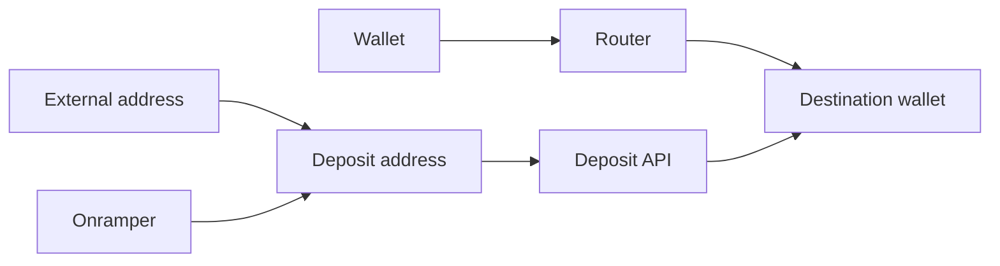

# Deposit

Architecture guide for the deposit and withdrawal flows. Keep cross-cutting invariants here; endpoint schemas and screen-level behavior belong in types, tests, and code comments.

## Flows

| Method | Transaction sender | Implementation |
| --- | --- | --- |
| Deposit via wallet | Connected wallet signs a Router transaction | `wallet/` |
| Deposit via address | User sends from a wallet or exchange | `address/` |
| Buy with cash/card | Onramper provider sends the purchased asset | `onramp/` |

`/deposit` is the method hub. `/withdraw` uses the same `TransferFlow` engine as the wallet method, which is why that directory uses transfer-oriented names.

The hub has one React Hook Form whose `page` field controls navigation. The wallet method embeds a separate form because `TransferFlow` must also run independently for withdrawals. Address and onramp deposits share `DepositTracking`.

## Deposit address invariants

The Deposit API derives a reusable address from `(wallet_address, dst_chain_id, dst_asset_denom)`. The source chain and asset are resolved after funds arrive.

- Address and onramp deposits use the same backend pipeline. The frontend does not sign, pay gas, or choose the route.
- Address issuance returns a fresh `cursor`. New-deposit polling uses it to exclude earlier deposits at the same reusable address; an earlier active deposit is offered separately as a resumable transfer.
- Deposit API v1 has no refund flow. Unsupported or below-minimum transfers require manual recovery, so source support and minimum checks must fail closed.
- Slippage is backend policy, not user input. The operator sponsors gas and charges no service fee.
- API amounts are integer base-unit strings. Decimals are network-specific, even for the same asset.

The backend repository is the source of truth for the HTTP contract. Wire statuses are opaque to the client; UI and polling decisions use the server-provided `bucket`. `amount_out` is a routing estimate, not a measured receipt.

## Onramper boundary

Onramper buys a supported source asset and sends it to the deposit address. From that point, the normal Deposit API flow takes over.

- Public lookups run in the browser with the publishable key.
- Checkout runs through `POST /v1/onramper/checkout` because Onramper requires a server-held signing secret. The backend derives the deposit address again from the destination triple and never signs a client-supplied address.
- Checkout opens in a new tab so the widget can keep polling. The frontend tracks arrival at the deposit address, not fiat payment or KYC status.

## Configuration

`Config` exposes `depositApiUrl`, `onramperApiUrl`, and `onramperApiKey`. `MAINNET` supplies production defaults. `TESTNET` sets all three to `undefined` explicitly so the config merge cannot inherit mainnet services.
