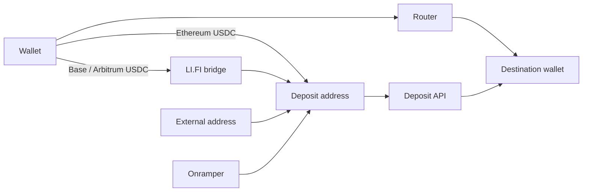

# Deposit

Architecture guide for the deposit and withdrawal flows. Keep cross-cutting invariants here; endpoint schemas and screen-level behavior belong in types, tests, and code comments.

## Flows

| Method              | Transaction sender                                                                                    | Implementation |
| ------------------- | ----------------------------------------------------------------------------------------------------- | -------------- |
| Deposit via wallet  | Connected wallet signs a Router transaction, or a Deposit API transfer for canonical USDC (see below) | `wallet/`      |
| Deposit via address | User sends from a wallet or exchange                                                                  | `address/`     |
| Buy with cash/card  | Onramper provider sends the purchased asset                                                           | `onramp/`      |

`/deposit` is the method hub. `/withdraw` uses the same `TransferFlow` engine as the wallet method, which is why that directory uses transfer-oriented names.

```mermaid
flowchart LR
  W[Wallet] --> R[Router] --> D[Destination wallet]
  W -- Ethereum USDC --> DA[Deposit address]
  W -- Base / Arbitrum USDC --> L[LI.FI bridge] --> DA
  A[External address] --> DA
  O[Onramper] --> DA
  DA --> API[Deposit API] --> D
```

The hub has one React Hook Form whose `page` field controls navigation. The wallet method embeds a separate form because `TransferFlow` must also run independently for withdrawals. Address and onramp deposits share `DepositTracking`.

## Deposit address invariants

The Deposit API derives a reusable address from `(wallet_address, dst_chain_id, dst_asset_denom)`. The source chain and asset are resolved after funds arrive.

- Address and onramp deposits use the same backend pipeline. The frontend does not sign, pay gas, or choose the route.
- Address issuance returns a fresh `cursor`. New-deposit polling uses it to exclude earlier deposits at the same reusable address; an earlier active deposit is offered separately as a resumable transfer.
- Deposit API v1 has no refund flow. Unsupported or below-minimum transfers require manual recovery, so source support and minimum checks must fail closed.
- Slippage is backend policy, not user input. The operator sponsors gas and charges no service fee.
- API amounts are integer base-unit strings. Decimals are network-specific, even for the same asset.

The backend repository is the source of truth for the HTTP contract. Wire statuses are opaque to the client; UI and polling decisions use the server-provided `bucket`. `amount_out` is a routing estimate, not a measured receipt.

## Deposit API wallet transports

`wallet/` resolves exactly one executor per form selection (`depositSources.ts`, `resolveDepositTransport`). Withdraw, an unconfigured `depositApiUrl`, and every source outside the three canonical USDC pairs (Ethereum `1`, Base `8453`, Arbitrum `42161`) keep the Router path unchanged. A supported pair whose destination the Ethereum USDC route feeds (`config/assets`) is executed by the Deposit API; while that catalog is loading or failing only those three sources are unavailable, never silently handed to Router.

- **Direct (Ethereum):** one ERC-20 `transfer` to the address issued for the _final recipient_ (host `recipientAddress` or the connected wallet, canonical bech32). Correlated by the exact source hash through `GET /v1/deposits/by-source-tx`, then tracked by deposit id.
- **LI.FI (Base, Arbitrum):** `POST /v1/bridges/options` lists routes, ranked by net value (output minus gas) with the fastest first among those within 0.5% or five cents of the best; `POST /v1/bridges/quote` returns the exact call; parsers in `data/bridges.ts` bind every response to the retained request before it can be signed. Tracking polls `GET /v1/bridges/status` without the `bridge` hint until `deposit_indexed`, validates the nested deposit against the issued address, recipient and destination (its `src_tx_hash` is the Ethereum receiving transaction, never the source hash), then tracks by deposit id.
- **Quotes** go stale after 10 s. A click on a stale quote re-reads it inside the click, like the Router preview: an unchanged quote is signed in the same click; a materially changed one (route, contract, native value, approval, amounts) shows "Quote updated" and needs a fresh click. That re-read is a real await inside the click, which popup wallets on Safari cannot survive; the send already leaves the click task through ethers' own scheduling (see the known limitation), so nothing is lost today, but it is the constraint to revisit if that ever changes. Calldata and gas estimates change on every quote and are not part of that review. The direct path has no quote to review.
- **Sessions** (`depositSession.ts`): one versioned localStorage record per transfer, written and read back before any wallet prompt, with monotonic phases; a remount reuses the record while it is still re-signable, and a record for the same transfer whose wallet prompt is still open or whose send is ambiguous (on this mount, a reopened widget, or another tab) blocks the form with "View progress". A wallet call that returns neither a hash nor a provable refusal locks the form as an ambiguous send; nothing is ever re-sent automatically. Sessions that reached the send prompt and are not terminal are offered as "Continue deposit" on the hub.
- **Chain reads** (`evmRpc.ts`) use one JSON-RPC provider per source chain from the catalog (`DEPOSIT_API_SOURCES[].rpcUrl`), never the wallet's provider: balances, allowance, fee, the head block read just before the send prompt, and receipt/replacement detection through ethers' `replaceableTransaction`. Base and Arbitrum are pinned to endpoints that serve `eth_getTransactionReceipt`, which the Router registry ones refuse.
- **Time estimate:** the Ethereum → destination leg is the `/v1/quote` `delivery` prediction (fast "advance" or standard), or `processing_time_seconds` when the backend sends none; LI.FI routes add their own bridge duration. Progress shows the deposit's `delivery.estimated_completion_at` until it passes.
- **Buckets:** the wallet controller classifies an unknown wire bucket as a tracking problem (`classifyWalletBucket`), not a failure; the shared `displayBucket`/`isTerminalBucket` used by the address and onramp screens are unchanged. Only `bucket=completed` completes a flow. Fast versus ordinary delivery is backend policy surfaced through `advance_status`.

## Onramper boundary

Onramper buys a supported source asset and sends it to the deposit address. From that point, the normal Deposit API flow takes over.

- Public lookups run in the browser with the publishable key.
- Checkout runs through `POST /v1/onramper/checkout` because Onramper requires a server-held signing secret. The backend derives the deposit address again from the destination triple and never signs a client-supplied address.
- Checkout opens in a new tab so the widget can keep polling. The frontend tracks arrival at the deposit address, not fiat payment or KYC status.

## Configuration

`Config` exposes `depositApiUrl`, `onramperApiUrl`, and `onramperApiKey`. `MAINNET` supplies production defaults. `TESTNET` sets all three to `undefined` explicitly so the config merge cannot inherit mainnet services.
