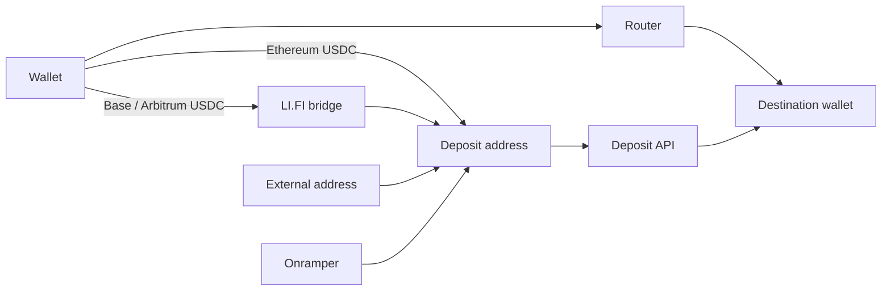

# Deposit

Architecture guide for the deposit and withdrawal flows. Keep cross-cutting invariants here; endpoint schemas and screen-level behavior belong in types, tests, and code comments.

## Flows

| Method              | Transaction sender                                                                                    | Implementation |
| ------------------- | ----------------------------------------------------------------------------------------------------- | -------------- |
| Deposit via wallet  | Connected wallet signs a Router transaction, or a Deposit API transfer for canonical USDC (see below) | `wallet/`      |
| Deposit via address | User sends from a wallet or exchange                                                                  | `address/`     |
| Buy with cash/card  | Onramper provider sends the purchased asset                                                           | `onramp/`      |

`/deposit` is the method hub. `/withdraw` uses the same `TransferFlow` engine as the wallet method, which is why that directory uses transfer-oriented names.

```mermaid
flowchart LR
  W[Wallet] --> R[Router] --> D[Destination wallet]
  W -- Ethereum USDC --> DA[Deposit address]
  W -- Base / Arbitrum USDC --> L[LI.FI bridge] --> DA
  A[External address] --> DA
  O[Onramper] --> DA
  DA --> API[Deposit API] --> D
```

The hub has one React Hook Form whose `page` field controls navigation. The wallet method embeds a separate form because `TransferFlow` must also run independently for withdrawals. Address and onramp deposits share `DepositTracking`.

## Deposit address invariants

The Deposit API derives a reusable address from `(wallet_address, dst_chain_id, dst_asset_denom)`. The source chain and asset are resolved after funds arrive.

- Address and onramp deposits use the same backend pipeline. The frontend does not sign, pay gas, or choose the route.
- Address issuance returns a fresh `cursor`. New-deposit polling uses it to exclude earlier deposits at the same reusable address; an earlier active deposit is offered separately as a resumable transfer.
- Deposit API v1 has no refund flow. Unsupported or below-minimum transfers require manual recovery, so source support and minimum checks must fail closed.
- Slippage is backend policy, not user input. The operator sponsors gas and charges no service fee.
- API amounts are integer base-unit strings. Decimals are network-specific, even for the same asset.

The backend repository is the source of truth for the HTTP contract. Wire statuses are opaque to the client; UI and polling decisions use the server-provided `bucket`. `amount_out` is a routing estimate, not a measured receipt.

## Deposit API wallet transports

`wallet/` resolves one executor per form selection (`resolveDepositTransport`). Withdraw, an unconfigured `depositApiUrl`, and every source other than USDC on Ethereum `1`, Base `8453` and Arbitrum `42161` keep the Router path. While `config/assets` is loading or failing, those three sources are unavailable, never handed to Router.

- **Direct (Ethereum):** one ERC-20 `transfer` to the address issued for the final recipient, correlated by its exact hash through `GET /v1/deposits/by-source-tx`.
- **LI.FI (Base, Arbitrum):** routes are ranked by output minus gas and on-top fees (`fee_cost_usd`, paid as the call's native value), less $0.02 per minute of bridge time, so a route minutes faster beats one a few cents better but seconds never outweigh a real price gap. The picker tags the top route Best, and the fastest and cheapest when they differ. `data/bridges.ts` binds every quote field, including the options' deposit address, to the retained request before it can be signed. Tracking polls `GET /v1/bridges/status` until `deposit_indexed` and checks the nested deposit against the issued address, recipient and destination.
- **Quotes:** a quote older than 10 s is re-read inside the click. One on the same route whose guaranteed amount fell by at most 0.1% and native fee rose by at most 1%, still clearing the minimums, is signed in the same click; anything else needs another click. Approval and deposit require separate clicks; confirming an approval never starts the deposit automatically.
- **Sessions** (`depositSession.ts`): one localStorage record per transfer, written and read back before the deposit's wallet prompt (an approval only grants an allowance). The in-flight check and that record are one step under a cross-tab Web Lock, so an open prompt or an ambiguous send for the same transfer, on any mount or tab, locks the form. A send whose inputs changed, or whose form closed, before the prompt is rolled back; nothing is ever re-sent automatically.
- **Hashless sends:** the hash is recorded the moment the wallet returns it. A send without one is released as not sent only when the sender's mined and pending nonces still match the ones read before the prompt six minutes after the last prompt heartbeat, past WalletConnect's five-minute request expiry. After ten minutes, with no tab still holding the prompt, the user can close it with "I didn't send this".
- **Chain reads** (`evmRpc.ts`) use a pinned JSON-RPC provider per source chain, never the wallet's, failing over across keyless public endpoints on a timeout, a non-OK response, or a capacity error. Widget code never uses an RPC that needs an API key. The source watch reads the receipt and the sender nonce each poll, and scans blocks from the pre-send head only once another transaction has taken the nonce.
- **Buckets:** an unknown bucket shows "Status unavailable" on both tracking screens and keeps polling; it is never a failure. Only `bucket=completed` completes a flow.

For LI.FI inputs, the optional asset field `bridge_min_input_amount` is the inclusive
minimum entered before fees. `min_deposit_amount` and options' `required_min_received`
remain the Ethereum receive floors. For example, input `5000000` (5 USDC) and a
`4715799` minimum receive can pass when `bridge_min_input_amount` is `5000000` and
both receive floors are `100000` (0.1 USDC). The widget never compares the net
amount with the gross input floor. Missing input policy preserves older API
behavior; malformed policy fails asset parsing. Direct Ethereum transfers use
the processing floor. Deploy the backend input validation before the widget,
and keep API and processing-service receive configuration aligned. No quote or
UI check guarantees a route will always be available at a fixed input amount.

Bridge status outages are failed reads, not failed transfers. Gateway HTML 5xx responses, browser network/CORS failures, and the API's `200 bridge_pending` fallback with `status_unavailable: true` keep the last validated observation, including receiving transaction links, so an outage cannot overwrite a known refund or delivery state. After a reload, the session's saved bridge state stands in until a fresh read succeeds. The poll interval is the only retry cadence; neither ky nor React Query retries inside a poll. Identity conflicts and malformed responses still stop tracking, and read retries never sign or resend a transaction.

## Onramper boundary

Onramper buys a supported source asset and sends it to the deposit address. From that point, the normal Deposit API flow takes over.

- Public lookups run in the browser with the publishable key.
- Checkout runs through `POST /v1/onramper/checkout` because Onramper requires a server-held signing secret. The backend derives the deposit address again from the destination triple and never signs a client-supplied address.
- Checkout opens in a new tab so the widget can keep polling. The frontend tracks arrival at the deposit address, not fiat payment or KYC status.

## Configuration

`Config` exposes `depositApiUrl`, `onramperApiUrl`, and `onramperApiKey`. `MAINNET` supplies production defaults. `TESTNET` sets all three to `undefined` explicitly so the config merge cannot inherit mainnet services.
