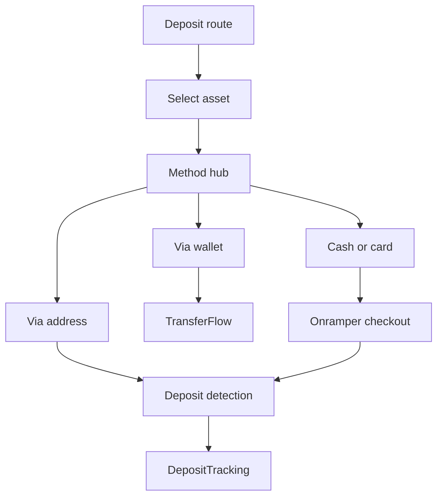
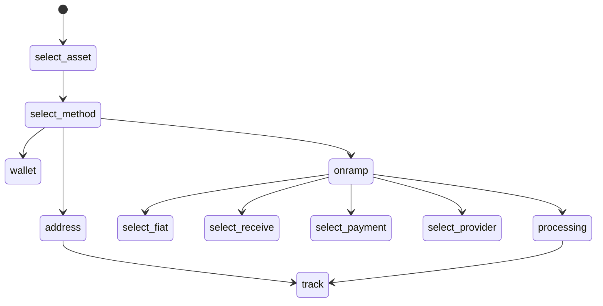
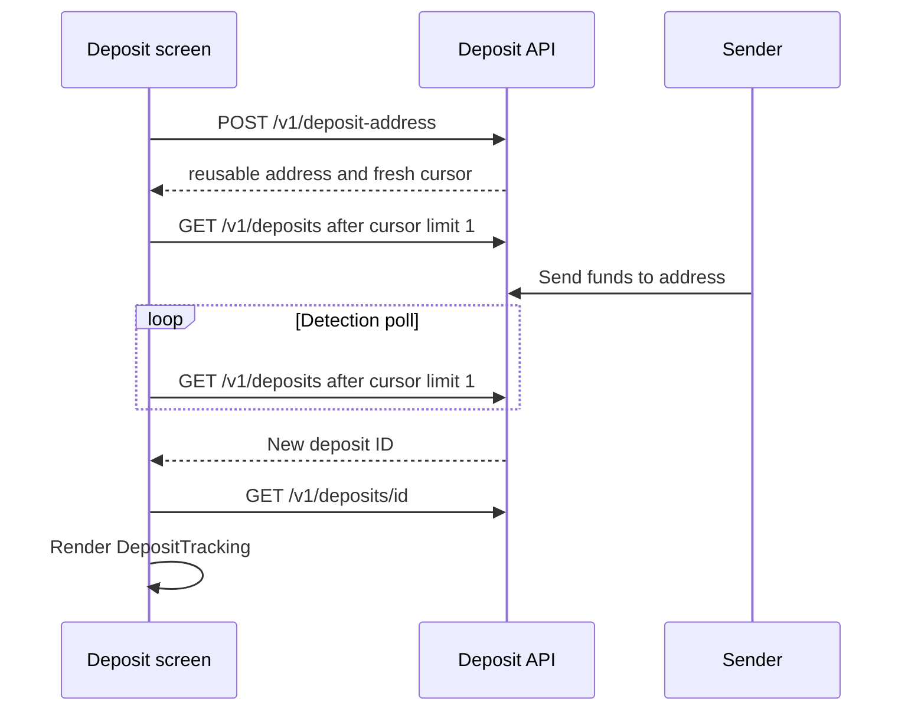
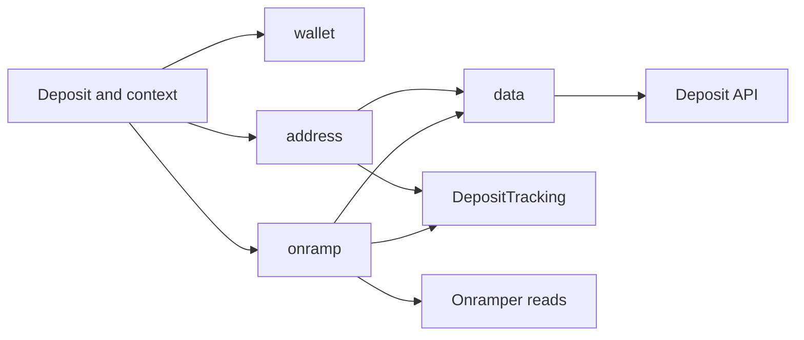

# Deposit architecture

Deposit은 하나의 `/deposit` route에서 세 가지 입금 방법을 제공한다. `Deposit.tsx`가 React Hook Form을 만들고, `page` 필드로 hub와 하위 화면을 전환한다. 브라우저 URL이나 MemoryRouter route를 단계마다 추가하지 않는다.

HTTP 세부 규격은 [Deposit API](./API_DEPOSIT.md), [Onramper API](./API_ONRAMPER.md), 파일별 검토 항목은 [code review](./2_REVIEW_CODE.md)를 참고한다.

## Flow ownership

`DepositFormValues`는 선택한 수신 자산, method, 추적할 deposit ID, Onramper 입력값을 유지한다. `useDepositNavigate()`는 `page`를 변경하고, `useSelectDepositMethod()`는 `method`와 첫 page를 함께 설정한다.



`wallet`은 독립 `TransferFlow`다. Hub에서 선택한 수신 자산을 초기 목적지로 전달하지만 자체 React Hook Form과 page state를 사용한다. `address`와 `onramp`만 Deposit API의 reusable address로 입금을 감지하고 같은 `DepositTracking` 화면을 사용한다. 따라서 `DepositMethod`에는 `address | onramp`만 존재한다.

Method hub의 가용성 경계는 다음과 같다.

| Method       | 소유 모듈                    | 가용성                                                |
| ------------ | ---------------------------- | ----------------------------------------------------- |
| Via wallet   | `wallet/TransferFlow.tsx`    | Deposit API와 무관하게 제공                           |
| Via address  | `address/DepositAddress.tsx` | `depositApiUrl`과 선택한 수신 자산의 route 필요       |
| Cash or card | `onramp/`                    | Address 조건, `onramperApiUrl`, `onramperApiKey` 필요 |

Host가 `recipientAddress` 또는 `remoteOptions`를 지정하면 address와 cash method를 비활성화한다. 이 두 method는 연결된 지갑을 목적지로 사용하고 host의 source 제한을 적용할 수 없기 때문이다. Wallet method만 해당 host 제한을 처리한다.

## Page state and presentation



실제 `page` 값은 `select-asset`, `select-method`, `wallet`, `address`, `onramp`, `onramp-select-fiat`, `onramp-select-receive`, `onramp-select-payment`, `onramp-select-provider`, `onramp-processing`, `track`이다.

표현 책임은 두 컴포넌트로 분리한다.

- `DepositSurface`는 page chrome인 background, padding, radius, clipping을 소유한다.
- `DepositPageTransition`은 cross-fade와 leaving page의 absolute positioning만 소유한다. Reduced motion에서는 즉시 전환한다.

Deposit hub의 일반 page는 각각 `DepositSurface`로 감싼다. `wallet` page는 예외다. Nested `TransferFlow`의 각 page가 자체 surface를 제공하므로 hub surface를 추가하지 않는다. 이 경계로 nested flow의 background와 padding이 중복되지 않는다.

## Address deposit

사용자는 destination asset을 먼저 고른 뒤 address 화면에서 source asset과 source network를 모두 선택할 수 있다. `config/assets` route가 source asset별 지원 network, minimum deposit, read-only slippage policy를 제공한다. Deposit address는 source 선택과 무관하고 다음 destination tuple로 결정된다.

```text
(connected wallet, destination chain ID, destination denom)
```

`POST /v1/deposit-address`는 reusable EVM address와 opaque cursor를 반환한다. Client는 address 형식과 응답의 destination tuple을 확인한다. Source asset이나 network를 바꿔도 address는 바뀌지 않는다.

### Cursor based detection

화면을 mount할 때마다 `useFreshDepositAddress()`가 address 요청을 다시 실행해 fresh cursor를 받는다. Cached response는 mount 이후 요청이 성공할 때까지 QR과 checkout에 제공하지 않는다. Window focus와 reconnect에 의한 background cursor 재발급도 비활성화한다.



새 입금 감지는 `GET /v1/deposits?deposit_address=...&after=...&limit=1`을 사용한다. Creation time이 cursor 이후인 record가 하나라도 있으면 해당 ID를 form에 저장하고 tracking으로 이동한다. 이 방식은 빠르게 terminal 상태가 된 새 입금도 찾고, reusable address의 과거 입금은 자동 이동에서 제외한다.

과거 session에서 시작해 아직 처리 중인 입금은 별도 `GET /v1/deposits?deposit_address=...&active=true&limit=1`로 조회한다. 이 결과는 자동 이동에 사용하지 않고 사용자가 선택하는 resume link로 표시한다.

List와 detail 응답의 `deposit_address`가 요청한 address와 다르면 hard error로 처리한다. 지원하지 않는 asset과 minimum 미만의 입금은 환불되지 않으므로 UI는 source route의 minimum과 지원 범위를 표시한다.

## Polling and lifecycle

| Poll           | 초기 interval | 5분 이후 | 종료 조건              |
| -------------- | ------------- | -------- | ---------------------- |
| 새 입금 감지   | 3초           | 15초     | 화면 전환 또는 unmount |
| Deposit detail | 3초           | 15초     | Terminal bucket 수신   |
| Active resume  | 15초          | 15초     | 화면 전환 또는 unmount |

Detail poll은 `waiting`과 `processing`에서 계속하고 `completed`, `failed`, `below_minimum`에서 중단한다. `status`는 표시용 lifecycle detail로만 취급하고 polling이나 화면 분기에 사용하지 않는다. Server는 unknown status를 `failed` bucket으로 매핑한다. Client도 unknown bucket을 failed 화면으로 표시하고 terminal로 판정해 detail poll을 중단한다. 양쪽 경계 모두 fail-closed다.

## Cash and Onramper

Cash flow는 Onramper에서 destination asset을 직접 사지 않는다. Deposit route와 Onramper supported assets를 매칭해 source crypto를 구매하고, payout destination으로 reusable deposit address를 전달한다. 이후 감지와 tracking은 address method와 동일하다.

Checkout은 fresh cursor와 address 발급이 완료된 뒤 한 번만 시작한다. `POST /v1/onramper/checkout`에 connected wallet, destination tuple, provider, fiat, source crypto, network, amount, payment method, idempotency key를 전달한다. Deposit API가 address를 다시 파생하고 Onramper의 server-only checkout intent를 생성한다. 반환 URL은 새 tab에서 열며 수동 continue link도 유지한다.

MAINNET의 read base URL은 `https://deposit-api.initia.xyz/v1/onramper`다. 따라서 다음 Onramper read 요청도 기본적으로 Deposit API proxy를 통과한다.

| Purpose           | Request relative to `onramperApiUrl`    |
| ----------------- | --------------------------------------- |
| Fiat and crypto   | `GET /supported?type=buy`               |
| Provider metadata | `GET /supported/onramps/all?type=buy`   |
| Geo defaults      | `GET /supported/defaults/all?type=buy`  |
| Payment methods   | `GET /supported/payment-types/{source}` |
| Quotes            | `GET /quotes/{fiat}/{crypto}`           |

Checkout은 `onramperApiUrl`이 아니라 `depositApiUrl`의 `POST /v1/onramper/checkout`을 항상 사용한다. `onramperApiUrl`을 설정하면 read client의 base URL만 교체하므로 Onramper direct API나 mock server를 사용할 수 있다. Read 요청에는 configured publishable key를 raw `Authorization` header로 전달한다.

## Module boundaries



| Area                        | Responsibility                                                              |
| --------------------------- | --------------------------------------------------------------------------- |
| `Deposit.tsx`, `context.ts` | Hub form, page dispatch, method selection, tracked ID                       |
| `SelectDepositMethod.tsx`   | Method visibility, availability gates, entry navigation                     |
| `address/`                  | Source asset and network selection, QR, new deposit detection, resume link  |
| `onramp/`                   | Fiat inputs, provider quote, checkout handoff, new deposit detection        |
| `data/depositAddress.ts`    | Address response boundary parsing, cached address query, mount-fresh cursor |
| `data/deposits.ts`          | List and detail polls, address checks, interval policy, terminal policy     |
| `data/types.ts`             | Deposit API wire types and stable bucket sets                               |
| `DepositTracking.tsx`       | Shared lifecycle UI for address and cash methods                            |
| `DepositSurface.tsx`        | Page chrome                                                                 |
| `DepositPageTransition.tsx` | Transition and positioning                                                  |

## Deposit API endpoints

| Endpoint                     | Client responsibility                                          |
| ---------------------------- | -------------------------------------------------------------- |
| `GET /v1/config/assets`      | Supported source routes and destination networks               |
| `POST /v1/deposit-address`   | Reusable address and fresh detection cursor                    |
| `GET /v1/deposits`           | Cursor detection and active resume lookup                      |
| `GET /v1/deposits/{id}`      | Authoritative lifecycle detail polling                         |
| `GET /v1/quote`              | Destination amount and minimum received estimate for cash flow |
| `POST /v1/onramper/checkout` | Signed Onramper checkout creation through Deposit API          |
