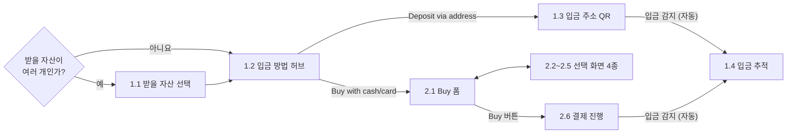
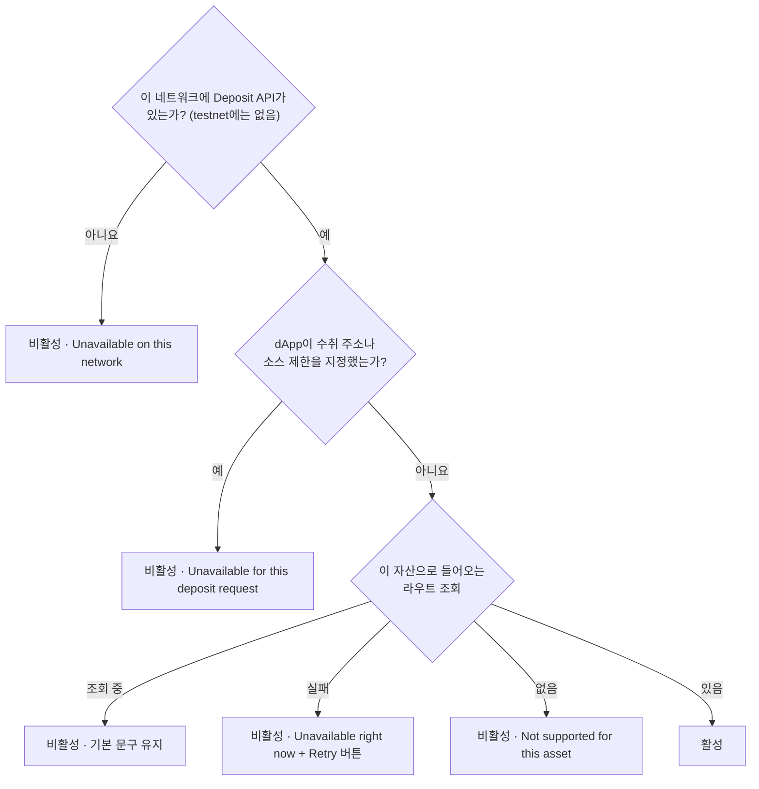
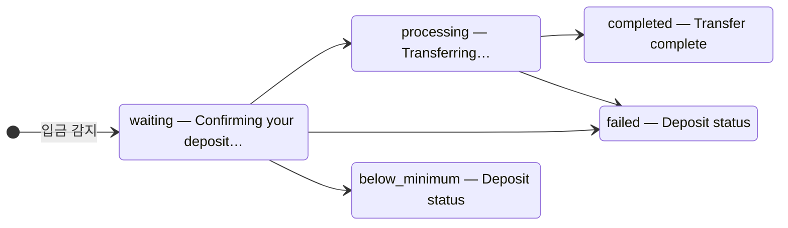
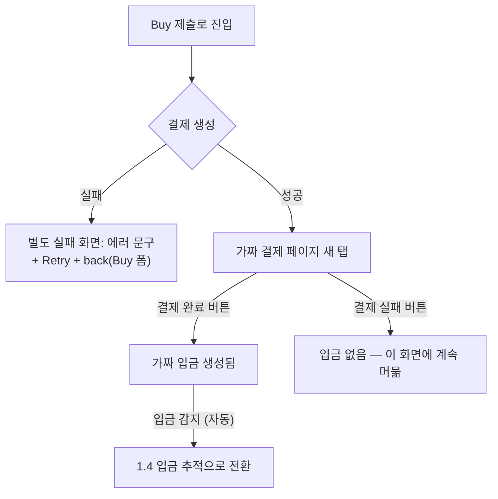

# E2E 검증 — 화면 전수 목록 (스타일시트 검토 준비)

> **개발용 임시 문서.** 개발 중에만 쓰고 구현이 안정화되면 삭제하므로, 코드 주석에서 이 문서를 링크하거나 참조하지 마라.

> 화면 검토자는 이 inventory로 신설된 두 입금 방법의 모든 state를 재현한다. 기능 판정은 [1_REVIEW_E2E_AI.md](./1_REVIEW_E2E_AI.md)와 [1_REVIEW_E2E_HUMAN.md](./1_REVIEW_E2E_HUMAN.md), 디자인 판정은 [3_REVIEW_DESIGN.md](./3_REVIEW_DESIGN.md) 소관이다. wallet 경로는 범위 밖이다. 배경은 [0_OVERVIEW.md](./0_OVERVIEW.md), mock 상세는 [mock/README.md](../../../../../../mock/README.md)를 참조한다.

## 준비 checklist

- [ ] Deposit mock(:8788)과 해당 URL을 항상 사용하는 example 앱을 실행한다([실행 방법](../../../../../../mock/README.md#실행)).
- [ ] Onramper read 오류를 검증하면 mock(:8789)을 추가로 실행하고 test host의 `InterwovenKitProvider`에 `onramperApiUrl="http://localhost:8789"`를 전달한다. Example 앱은 해당 env를 읽지 않는다.
- [ ] 아래 흐름 순서대로 각 표의 정상, 로딩, 에러, 빈 상태, 터미널 state를 재현한다.
- [ ] 각 재현 후 `responseDelayMs`와 `errorRate`를 0으로 되돌린다.

## 전체 흐름

두 경로는 같은 진입 화면을 거치고, 같은 추적 화면에서 끝난다. 공유 화면은 1번 섹션에서 기술하고 2번 섹션에는 차이만 적는다.

공통 사항: 화면 전환은 크로스페이드(모션 줄이기 설정 시 즉시 교체). back 화살표는 이전 화면이 있을 때만 위젯 좌상단에 나타난다(우상단 닫기 X와 같은 높이).

"재현" 열은 다음 HTTP control을 가리킨다.

| 목적      | HTTP control                                                                                       |
| --------- | -------------------------------------------------------------------------------------------------- |
| 설정      | `PATCH /__mock/config`                                                                             |
| 입금 생성 | `POST /__mock/deposits`                                                                            |
| 상태 진행 | `POST /__mock/deposits/{id}/advance`                                                               |
| 상태 강제 | `POST /__mock/deposits/{id}/status`                                                                |
| 초기화    | `POST /__mock/reset`                                                                               |
| 결제      | Checkout 새 tab의 **Complete payment** / **Fail payment** button. `checkoutMode` 기본값은 `manual` |

에러와 로딩은 해당 mock의 `PATCH /__mock/config`로 재현한다. `responseDelayMs`를 올리면 loading UI, `errorRate`를 1로 두면 error UI가 나온다. Deposit 설정은 주소 발급, 입금 polling, backend quote에 적용한다. Onramper 설정은 통화, 결제수단, provider quote 조회에 적용한다. 확인 후 0으로 되돌린다.

## 1. Deposit via address

아무 지갑이나 거래소에서 입금 주소로 자산을 보내는 경로. 입금이 감지되면 추적 화면으로 자동 전환하며, "보냈어요" 같은 확인 버튼은 없다. **실제 송금 없이도 control API의 입금 생성으로 감지부터 추적까지 재현된다.**

### 1.1 받을 자산 선택 — SelectAsset

dApp이 받을 자산을 여러 개 지정했을 때만 나타난다. **하나면 이 화면은 스킵**되고 허브에서 시작한다.

| 변형      | 표시                          | 재현                                                                     |
| --------- | ----------------------------- | ------------------------------------------------------------------------ |
| 정상      | 자산 목록                     | 여러 자산으로 Deposit 열기                                               |
| 선택 직후 | 목록이 잠시 비활성(busy)      | 자산 클릭 직후                                                           |
| 로딩·에러 | "Loading..." / 모달 공통 에러 | 자산 메타데이터 조회 소관 — mock 범위 밖 (네트워크 스로틀·차단으로 재현) |

### 1.2 입금 방법 허브 — SelectDepositMethod

세 입금 방법을 고르는 화면. 제목 "Deposit {자산}". back 화살표는 1.1을 거쳐 왔을 때만.

**사용 불가한 방법은 숨기지 않고 비활성 + 사유 문구로 남긴다.** via wallet은 항상 활성이고, 나머지 두 방법은:

| 변형             | 재현                                                 |
| ---------------- | ---------------------------------------------------- |
| 라우트 조회 중   | Deposit `responseDelayMs: 3000` 설정 후 허브 재진입  |
| 라우트 조회 실패 | Deposit `errorRate: 1` 설정 후 허브 재진입           |
| Deposit API 없음 | `InterwovenKitProvider`에 `depositApiUrl: undefined` |
| 라우트 없음      | Deposit API가 지원하지 않는 자산으로 Deposit 열기    |

행별 분기:

- **via wallet**: 연결된 지갑 아이콘(없으면 기본 지갑 아이콘) + 축약 주소 문구("Your connected wallet · 0xA7…a2FA").
- **cash 행 문구** 우선순위: 비활성 사유 → Onramper 설정이 없으면 "Unavailable on this app" → 한도 조회 중·실패면 "Card or bank transfer" → 조회되면 "Up to $20,000" 류의 실제 한도. 조회 중·실패는 Onramper mock의 `responseDelayMs`와 `errorRate`로 재현한다.

### 1.3 입금 주소 QR — DepositAddress

제목 "Deposit {자산} via address", back은 허브로.

| 변형           | 표시                                                     | 재현                                                  |
| -------------- | -------------------------------------------------------- | ----------------------------------------------------- |
| 정상           | 체인 로고가 박힌 QR + 주소 + 복사 버튼                   | 기본                                                  |
| 주소 로딩      | QR 자리 로딩 + "Generating your deposit address…"        | Deposit responseDelayMs 후 진입                       |
| 주소 발급 실패 | QR 대신 에러 문구 (재시도 버튼 없음 — 확정 사항)         | Deposit errorRate 1 후 진입                           |
| 감지 폴링 실패 | QR 유지 + 아래에 "감지 일시 불가, 전송은 무사" 에러 문구 | QR 화면을 띄운 채 Deposit errorRate 1                 |
| → 추적 전환    | 자동으로 1.4로 넘어감                                    | 현재 목적지와 일치하는 body로 `POST /__mock/deposits` |

세부 분기:

- **Source asset 셀렉터**: 선택지가 하나면 정적 필드, 둘 이상이면 드롭다운이다. Asset을 바꾸면 Supported network와 minimum도 해당 route set으로 바뀐다.
- **Supported network 셀렉터**: 선택지가 하나면 화살표 없는 정적 필드, 둘 이상이면 드롭다운(로고 + 우측 최소 금액 + 선택 체크).
- **최소 입금액 줄**: 선택 체인의 최소 금액이 있을 때만. 그 아래 유실 경고 문구는 항상 표시.
- **복사 버튼**: 누르면 "Copy address" → "Copied!" 전환. 주소 없으면 비활성.
- **Transaction details**: 슬리피지 행은 라우트가 있을 때만. 처리 시간 값은 3상태 — 시간 / "Estimating…" / 경고 아이콘 + "Unavailable"(툴팁).

### 1.4 입금 추적 — DepositTracking

입금 감지 후에만 진입하는 공용 종착 화면. **back 버튼 없음** (디자인 확정). 입금 생성 후 mock 상태 머신이 기본 3초 간격으로 자동 진행된다. 단계별로 보려면 `autoAdvance: false`를 설정하고 `POST /__mock/deposits/{id}/advance`로 한 단계씩 진행한다.

(상태 이름 옆이 화면 제목. failed·below_minimum 제목은 디자인 미확정으로 범용 유지.)

| 상태          | 본문                                                                        | 하단 버튼                             | 재현                                             |
| ------------- | --------------------------------------------------------------------------- | ------------------------------------- | ------------------------------------------------ |
| waiting       | 로더 + "소스 체인에서 컨펌 중"(체인 로고) + 흐름 칩(You sent → You receive) | 없음                                  | 입금 생성 직후 (detected·accepted 단계)          |
| processing    | 로더 + "목적지로 옮기는 중" + 흐름 칩                                       | 없음                                  | 자동 진행 중간 단계 (funding·bridge)             |
| completed     | 성공 아이콘 + "{금액} 전달됨" + "View transaction \| Go to history" 링크    | "Make another transfer" (QR 화면으로) | 자동 진행 끝까지 대기                            |
| failed        | 실패 아이콘 + "Deposit failed" + 자금 잔류(환불 없음) 안내 + explorer 링크  | Close                                 | `{ "status": "failed" }`로 상태 강제             |
| below_minimum | 실패 아이콘 + "Amount below minimum" + 최소 금액 안내                       | Close                                 | 생성 body에 `{ "status": "below_minimum" }` 추가 |

그 외 변형:

- **하드 에러** ("Couldn't track your deposit" + Close): 주소 발급 실패 시 — Deposit errorRate 1 상태로 진입.
- **지연 안내** ("This is taking a little longer"): 같은 상태가 1분 이상 지속 — autoAdvance를 끄고 1분 방치.
- **폴링 에러 배너** ("Connection lost. Retrying…" — 진행 화면 유지): 추적 화면을 띄운 채 Deposit errorRate 1.
- **진입 직후**: 데이터가 잠깐 비는 순간엔 로더만 (일시적 프레임).

## 2. Buy with cash/card

카드와 계좌이체로 crypto를 사서 입금하는 경로. 진입(1.1 → 1.2)은 공용이며 cash 행 분기는 1.2를 참조한다. 조회와 견적은 configured `onramperApiUrl`을 사용하고 **Deposit mock은 checkout만 가짜 결제 page로 대체**한다.

### 2.1 Buy 폼 — OnrampFields

제목 "Buy {자산}", back은 허브로. 각 항목을 누르면 선택 화면(2.2~2.5)이 열리고, 하단 버튼이 2.6으로 보낸다.

**하단 버튼**은 정상 견적이 아닌 동안 항상 비활성이며(환불 없는 구매라 fail-closed), 라벨이 사유를 말한다:

| 상황                                   | 버튼 라벨                      | 재현                                    |
| -------------------------------------- | ------------------------------ | --------------------------------------- |
| 이 자산은 구매 불가                    | "Not available for this asset" | Onramper 미지원 자산 선택               |
| 금액 미입력                            | "Enter amount"                 | 진입 직후                               |
| 결제수단의 fiat 한도 범위 밖           | "Amount out of range"          | 극단적 금액 입력 (예: 1 또는 999999999) |
| 견적 조회 중 / 백엔드 사전 견적 미확정 | "Getting quote…"               | Onramper(또는 Deposit) responseDelayMs  |
| 견적 실패 / 백엔드 사전 견적 거절      | "Quote unavailable"            | Onramper(또는 Deposit) errorRate 1      |
| 어떤 provider도 offer를 안 냄          | "No quote available"           | provider 하한 근처의 낮은 금액 입력     |
| 수령액이 브릿지 최소 금액 미만         | "Amount too low"               | 브릿지 최소값 미만이 되는 금액 입력     |
| 정상 견적                              | "Buy {자산}" (활성)            | 무난한 금액 (예: $100)                  |

사용자가 고칠 수 있는 사유(한도·최소 금액·provider 사유)는 버튼 위에 빨간 에러 문구로도 표시된다.

항목별 분기:

- **Receive 금액**: provider 선택 전엔 흐린 "0", 견적 후엔 수령액.
- **Payment method**: 미선택이면 "Select payment method". 아이콘이 없으면 일반 결제 아이콘.
- **Transaction details**: Provider 행은 견적 전 "—"(비활성), 후엔 이니셜 모노그램 + 이름. 예상 가격·수수료는 견적 전 "—". Minimum received(강조 행)는 백엔드 견적 전·거절 시 "—". 예상 시간은 1.3과 같은 3상태.

### 2.2 fiat 통화 선택 — SelectFiat

제목 "Select fiat currency". 검색창 고정 + 통화 목록. 검색 무결과 시 "No currencies". 로딩·에러는 Onramper responseDelayMs/errorRate로 재현(모달 공통 처리).

### 2.3 받을 자산 선택 — SelectReceiveChainAsset

제목 "Select receive assets". 구매 가능한 목적지 자산을 체인과 함께 나열. 보유 중인 자산 행에만 잔액·USD 가치 컬럼이 붙고, 현재 선택 행은 강조. 정렬은 보유 가치 높은 순.

### 2.4 결제수단 선택 — SelectPaymentMethod

제목 "Select payment method". 목록 영역은 다섯 상태 (순서대로 판정):

| 변형        | 표시                               | 재현                         |
| ----------- | ---------------------------------- | ---------------------------- |
| 미지원 자산 | "Not available for this asset"     | Onramper 미지원 자산 선택    |
| 에러        | 에러 메시지                        | Onramper errorRate 1         |
| 로딩        | "Loading…"                         | Onramper responseDelayMs     |
| 빈 목록     | "No payment methods"               | 결제수단 없는 통화·자산 조합 |
| 정상        | 아이콘+이름 목록, 선택 행에만 체크 | 기본                         |

### 2.5 provider 비교 — SelectProvider

제목 "Select provider". 목록 위에 "Provider / You receive" 헤더 상시 표시.

| 변형       | 표시                                               | 재현                      |
| ---------- | -------------------------------------------------- | ------------------------- |
| 로딩       | "Loading…"                                         | Onramper responseDelayMs  |
| 에러       | 실패 메시지 (장애가 "offer 없음"으로 읽히면 안 됨) | Onramper errorRate 1      |
| offer 없음 | provider가 보고한 사유                             | provider 하한 미만의 금액 |
| 정상       | 수령액 높은 순 목록                                | 무난한 금액으로 견적      |

정상 행: 1위에만 **"Best price" 배지**, 나머지엔 1위 대비 손해 백분율, 현재 선택 행은 강조.

### 2.6 결제 진행 — OnrampProcessing

제목 "Processing…", 정상 화면에는 back 없음. Buy 제출 시 진입해 결제 생성과 새 탭 핸드오프가 자동으로 일어난다. mock에서는 **가짜 결제 페이지**가 새 탭으로 열린다(checkoutMode manual 기본).

정상 화면 구성: provider 이니셜 모노그램 + "Please proceed with {Provider}" + "If you weren't redirected automatically, continue with {provider}" 수동 링크(checkout 생성 후 항상 표시) + 예상 시간 + "닫아도 거래는 계속됨" 안내 + 흐름 칩 3단(Pay 국기 → Buy 소스 크립토 → Receive 목적지 자산).

| 변형            | 표시                                                     | 재현                                               |
| --------------- | -------------------------------------------------------- | -------------------------------------------------- |
| 정상 + 핸드오프 | 위 구성 + 가짜 결제 페이지 새 탭                         | Buy 제출 (checkoutMode auto면 버튼 없이 자동 완료) |
| 팝업 차단       | 동일 화면 — 자동 열기만 무산, 수동 링크로 진행           | 브라우저에서 이 사이트 팝업 차단                   |
| 결제 생성 실패  | 별도 실패 화면 (에러 + Retry + back)                     | Deposit errorRate 1 후 Buy 제출                    |
| 주소 발급 실패  | "감지 준비 실패, 구매는 무사" 에러 문구 + **Retry** 버튼 | Deposit errorRate 1 (진입 시점에 걸리게)           |
| 감지 폴링 실패  | 에러 문구 추가 (주소 발급 실패가 있으면 그쪽만 표시)     | 화면을 띄운 채 Deposit errorRate 1                 |

### 2.7 추적 — 1.4의 onramp 차이

가짜 결제 페이지에서 **결제 완료**를 누르면 자동으로 도달한다. 화면은 1.4와 동일하고 onramp 경로일 때만:

- 완료 제목이 "Transaction complete" (address는 "Transfer complete").
- 완료 버튼이 흰색 강조 Close (address는 "Make another transfer").
- 흐름 칩의 "You sent"에 Onramper가 구매해 보낸 소스 크립토가 표시된다.
