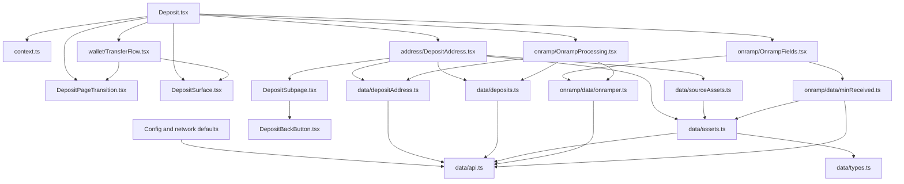
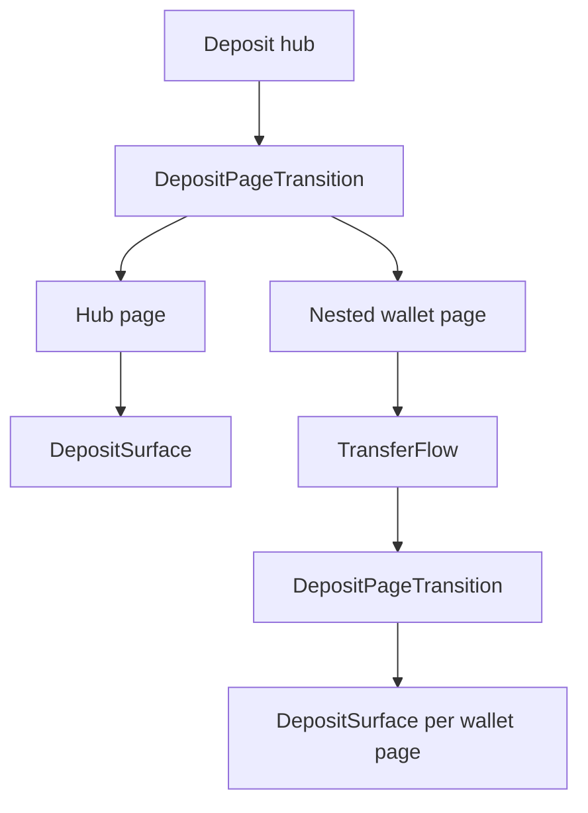
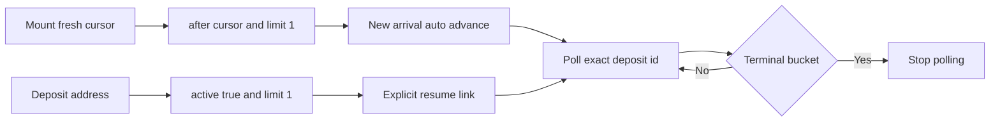

# Deposit 코드 리뷰 안내

이 문서는 현재 `pages/deposit` 구현을 리뷰하기 위한 읽기 순서와 확인 항목을 정리한다. 기능 개요는 [0_OVERVIEW.md](./0_OVERVIEW.md), API 세부 규격은 [API_DEPOSIT.md](./API_DEPOSIT.md), [API_ONRAMPER.md](./API_ONRAMPER.md)를 참조한다.

## Review scope와 우선순위

다음 순서로 리뷰한다.

1. 자금 손실을 막는 minimum, amount 단위 변환, route 선택, API boundary
2. 재사용 deposit address의 신규 입금 감지, 이전 입금 재개, terminal polling 중지
3. public `Config` 기본값과 network별 기능 비활성화
4. checkout payload 정규화, 외부 URL 검증, provider와 payment method 선택
5. form page state, nested wallet flow, surface ownership
6. pure/data test가 경계값과 fail-closed 동작을 검증하는지 확인

리뷰 대상의 중심은 다음 file group이다.

| Group         | 주요 파일                                                                                                                                                                                            | 책임                                                                          |
| ------------- | ---------------------------------------------------------------------------------------------------------------------------------------------------------------------------------------------------- | ----------------------------------------------------------------------------- |
| Hub           | `Deposit.tsx`, `context.ts`, `defaultValues.ts`                                                                                                                                                      | receive asset, method, page state와 method별 진입                             |
| Shared UI     | `DepositBackButton.tsx`, `DepositSurface.tsx`, `DepositPageTransition.tsx`, `DepositSubpage.tsx`                                                                                                     | back control, visual surface, page transition, subpage shell                  |
| Deposit data  | `data/api.ts`, `data/assets.ts`, `data/depositAddress.ts`, `data/deposits.ts`, `data/source.ts`, `data/sourceAssets.ts`, `data/types.ts`                                                             | API client, route config, address 발급, 감지와 추적, source option, wire type |
| Address       | `address/DepositAddress.tsx`, `address/SourceSelector.tsx`                                                                                                                                           | source asset과 chain 선택, QR, 신규 입금 감지, active 입금 재개               |
| Wallet        | `wallet/TransferFlow.tsx`와 `wallet/` 하위 form/data 파일                                                                                                                                            | 독립 RHF form을 사용하는 deposit과 withdraw transfer flow                     |
| Onramp        | `onramp/OnrampFields.tsx`, `onramp/OnrampProcessing.tsx`, `onramp/quote.ts`, `onramp/data/onramper.ts`, `onramp/data/onramperLogic.ts`, `onramp/data/onramperTypes.ts`, `onramp/data/minReceived.ts` | supported data, quote, minimum, checkout, 도착 감지                           |
| Public config | `public/data/constants.ts`, `data/config.ts`                                                                                                                                                         | network defaults와 host override surface                                      |

## Dependency map

`data/sourceAssets.test.ts`와 `data/types.test.ts`도 이 지도에서 각각 `data/sourceAssets.ts`, `data/types.ts`의 직접 검증 항목으로 취급한다.

## Surface ownership

`DepositSurface`가 background, padding, radius, corner clipping을 소유한다. `DepositPageTransition`은 fade transition과 leaving page의 absolute positioning만 소유한다. Hub의 일반 page는 `DepositSurface`로 감싸지만 nested `wallet` page에는 hub surface를 적용하지 않는다. `TransferFlow` 내부 각 page가 자체 surface를 제공하므로 중복 chrome이 생기지 않는다.

`DepositBackButton`은 modal chrome의 portal container에 back button을 배치하고 초기 render에는 page anchor를 fallback으로 사용한다. 짧은 viewport에서 content가 scroll되어도 back control이 close control과 함께 고정되는지 확인한다.

## Public Config와 network defaults

`Config`의 관련 public field는 모두 optional이다.

| Field            | MAINNET default                              | 역할                                   |
| ---------------- | -------------------------------------------- | -------------------------------------- |
| `depositApiUrl`  | `https://deposit-api.initia.xyz`             | Deposit API base URL                   |
| `onramperApiUrl` | `https://deposit-api.initia.xyz/v1/onramper` | Onramper proxy base URL                |
| `onramperApiKey` | bundled `pk_` key                            | domain rule로 제한되는 publishable key |

`MAINNET`은 Deposit API, Onramper proxy URL, publishable key를 제공한다. `TESTNET`은 세 field를 명시적으로 `undefined`로 지정한다. Provider가 mainnet defaults 위에 config를 spread하므로 field를 생략하면 mainnet 값이 남는다. 따라서 명시적 `undefined`는 testnet에서 mainnet onramp 설정을 제거하기 위한 의도된 동작이다.

Checklist:

- Host override가 `useDepositApi`, `useOnramper`, method availability에 일관되게 반영되는지 확인한다.
- `onramperApiUrl`과 `onramperApiKey`가 모두 있어야 cash method가 활성화되는지 확인한다.
- Publishable key의 노출 자체를 secret 유출로 판정하지 말고 domain restriction과 host override 동작을 확인한다.

## Deposit API boundary

`data/api.ts`는 Deposit API와 Onramper proxy용 `ky` instance, deposit query key를 제공한다. Deposit API client에는 CORS allowlist 밖의 custom header를 추가하지 않는다. Onramper client는 publishable key를 `Bearer` prefix 없이 `Authorization` header로 전달한다.

Boundary별 확인점:

- `data/assets.ts`의 `parseAssets`가 모든 route의 `min_deposit_amount`를 base-unit integer string으로, `src_decimals`를 0 이상의 integer로 확인한다.
- `data/depositAddress.ts`가 응답 object, 20-byte hex deposit address, 요청한 destination triple, non-empty cursor를 확인한다.
- `data/deposits.ts`가 list 응답의 모든 record가 요청한 deposit address에 속하는지 case-insensitive로 확인한다.
- `data/types.ts`는 wire의 `status`와 `bucket`을 open string으로 유지하고, UI 진입점에서 stable allowlist로 해석한다.
- `SUPPORTED_VM_TYPES`는 `move`, `evm`, `wasm`이다. `not_supported`와 unknown VM은 지원하지 않는 것으로 처리한다.
- Unknown bucket은 `displayBucket`에서 `failed`, terminal 판정에서 terminal로 처리해 fail-closed한다.

API 응답 전체를 schema parser로 변환하지 않는 현재 구조에서는 자금, 주소 소유권, polling 종료에 영향을 주는 field의 boundary guard가 충분한지 checklist로 검토한다. 확정 결함으로 간주하지 말고, 새 wire field를 소비할 때 진입 지점에서 한 번 parse하는지 확인한다.

## Address detection과 polling

Address 화면과 onramp processing 화면은 `useFreshDepositAddress`를 사용한다. Cache된 주소가 있어도 mount 이후 성공한 refetch가 새 cursor를 발급할 때까지 주소와 detection cursor를 사용하지 않는다. Focus와 reconnect refetch는 cursor가 이미 전송한 입금 뒤로 이동하는 것을 막기 위해 비활성화한다.

감지 경로는 두 개로 분리된다.

- 신규 감지는 `deposit_address`, fresh `after`, `limit=1`을 사용한다. 결과가 있으면 해당 exact id를 form에 저장하고 tracking으로 자동 전환한다.
- 이전 session의 진행 중 입금은 `active=true`, `limit=1`로 조회해 명시적 resume link로 제공한다. 이전 입금이 새 입금 의도를 대신해 자동 전환하지 않는다.
- 신규 감지와 detail polling은 화면 진입 후 5분까지 3초 간격, 이후 15초 간격을 사용한다. Active resume query는 처음부터 15초 간격이다.
- Detail polling은 terminal bucket에서 중지한다. Unknown bucket도 failed 화면과 terminal stop으로 처리한다.
- Address mismatch는 반복해도 복구되지 않는 data consistency 오류로 처리한다. 일시적인 network polling error와 같은 retry 안내로 표시하지 않는지 확인한다.

`address/DepositAddress.tsx`에서는 source asset과 source chain을 모두 선택할 수 있다. Source asset을 바꾸면 해당 asset의 route set, chain option, minimum, processing estimate가 함께 바뀐다. Deposit address 자체는 destination triple로 결정되므로 source 선택으로 바뀌지 않는다.

`data/sourceAssets.test.ts`는 모든 source asset option을 실제로 선택할 수 있는지, 선택값이 metadata update로 사라졌을 때 첫 option으로 fallback하는지, option이 없을 때 `undefined`인지 검증한다.

## Onramp boundary

`onramp/data/onramper.ts`의 현재 endpoint 사용은 다음과 같다.

| Endpoint                               | Client behavior                                                             |
| -------------------------------------- | --------------------------------------------------------------------------- |
| `GET supported?type=buy`               | fiat와 crypto 목록을 함께 가져오고 empty misconfiguration을 검사            |
| `GET supported/onramps/all?type=buy`   | provider metadata 조회                                                      |
| `GET supported/defaults/all?type=buy`  | geolocation 기반 recommended fiat 조회, 실패 시 default currency로 fallback |
| `GET supported/payment-types/{source}` | destination과 browser capability에 맞는 payment method 조회                 |
| `GET quotes/{fiat}/{crypto}`           | amount와 payment method별 provider quote를 30초마다 갱신                    |
| `POST v1/onramper/checkout`            | Deposit API를 통해 server-side checkout intent 생성                         |

Checkout은 raw object를 그대로 전달하지 않는다. `OnrampCheckoutParams`가 wallet destination, destination chain과 denom, provider, fiat, crypto, network, numeric amount, payment method, idempotency UUID를 typed input으로 받는다. `createCheckoutIntent`는 이를 explicit snake_case JSON payload로 정규화한다. Backend는 destination triple로 deposit address를 다시 파생하고 Onramper의 server-side checkout을 호출한다. 응답 URL은 사용 전에 HTTPS인지 확인한다.

Checklist:

- Fiat id와 uppercase display code를 혼용하지 않는지 확인한다.
- Destination asset과 Onramper가 구매할 source crypto를 혼용하지 않는지 확인한다.
- Supported, defaults, payment type, quote endpoint의 query key와 enabled condition이 입력을 모두 포함하는지 확인한다.
- Empty supported response, unavailable payment method, no quote, request error를 서로 다른 상태로 처리하는지 확인한다.
- Checkout payload가 선택한 quote와 form state에서 구성되고 UUID가 한 checkout attempt 동안 안정적인지 확인한다.
- External checkout URL이 허용된 protocol만 사용하는지 확인한다.

## Form과 page state

`Deposit.tsx`는 하나의 hub RHF form에서 `page`를 watch해 11개 화면을 전환한다. Receive asset은 symbol, denom, chain id로 저장한다. `method`는 shared tracking copy를 결정하고, `trackedDepositId`는 감지된 exact record를 유지한다. Onramp 선택값은 fiat id, fiat amount, payment method id, provider id로 저장한다.

`useDepositNavigate`의 callback identity는 auto-advance effect dependency로 사용되므로 안정적이어야 한다. `useSelectDepositMethod`는 `method`와 entry page를 함께 갱신하고, `useTrackDeposit`은 deposit id를 저장한 뒤 tracking으로 이동한다.

Wallet method는 hub form 안에 자체 RHF form을 가진 `TransferFlow`를 중첩한다. Hub가 선택한 destination을 `initialAsset`으로 전달하고 `onExit`으로 method hub에 복귀한다. Withdraw가 같은 flow를 독립적으로 사용하므로 wallet form state를 hub form에 합치지 않는다.

Checklist:

- Page 이동 시 method와 tracked id가 이전 path의 값과 잘못 조합되지 않는지 확인한다.
- Preset asset symbol을 비동기로 보완할 때 사용자가 고른 symbol을 덮어쓰지 않는지 확인한다.
- Onramp subpage 왕복과 wallet nested flow 이탈 후 입력값이 의도대로 유지되는지 확인한다.
- 불가능한 field 조합을 type만으로 막지 못하는 현재 flat form에서 submit과 navigation gate가 필요한 조합을 확인하는지 검토한다.

## Money와 minimum 계산

`data/assets.ts`의 route minimum은 source base unit string이다. Address 화면은 선택한 source asset과 chain route의 decimals로 표시한다. Source asset을 선택할 수 있으므로 첫 route의 minimum만 고정해 표시하면 안 된다.

`onramp/data/minReceived.ts`는 provider payout을 source token unit에서 source base unit으로 바꾸고 `ROUND_DOWN`으로 integer화한 뒤 Deposit API `GET /v1/quote`의 `amount_in`으로 보낸다. Backend의 `min_received`는 destination decimals로 다시 표시한다.

현재 submit gate는 current payout의 quote verdict가 settled될 때까지 fail-closed한다. HTTP 400은 backend가 해당 route나 amount를 거부한 `declined` data로 유지한다. Network와 5xx failure는 transient error channel로 처리하지만 settled verdict가 없으면 제출을 막고 failure state를 표시한다. `keepPreviousData`가 이전 amount의 값과 판정을 현재 amount의 판정처럼 사용하지 않는지 확인한다.

Money review checklist:

- User string, API string, number 각각에 맞는 BigNumber fallback을 사용하는지 확인한다.
- Empty string, zero, sub-base-unit payout이 guaranteed minimum으로 표시되지 않는지 확인한다.
- Payout의 base-unit 변환이 내림이며 precision이 route decimals를 따르는지 확인한다.
- Client route minimum과 backend live quote decline 중 하나라도 실패하면 checkout을 막는지 확인한다.
- Provider payout ranking, fee display, minimum received가 같은 quote를 참조하는지 확인한다.

## Test coverage

현재 deposit 영역에는 component render test가 없다. Test는 pure/data logic에 집중한 co-located Vitest다.

| Test group                                              | 핵심 검증                                                                                         |
| ------------------------------------------------------- | ------------------------------------------------------------------------------------------------- |
| `defaultValues.test.ts`, `wallet/defaultValues.test.ts` | hub와 wallet form 초기값                                                                          |
| `data/assets.test.ts`                                   | route fund-critical field parsing과 destination support                                           |
| `data/depositAddress.test.ts`                           | response destination 일치, address, cursor, fresh data 선택                                       |
| `data/deposits.test.ts`                                 | address ownership, polling interval, terminal stop, unknown bucket fail-closed, exact record 추적 |
| `data/source.test.ts`                                   | denom, minimum, slippage, fallback formatting                                                     |
| `data/sourceAssets.test.ts`                             | 모든 source asset 선택과 metadata 변경 fallback                                                   |
| `data/types.test.ts`                                    | 지원 VM set과 `unknown` 및 `not_supported` fail-closed                                            |
| `onramp/quote.test.ts`                                  | quote state와 provider 선택                                                                       |
| `onramp/data/minReceived.test.ts`                       | decline 분류, settlement, stale data, amount 표시                                                 |
| `onramp/data/onramperLogic.test.ts`                     | supported data, payment capability, quote ranking, limits, checkout URL                           |
| `wallet/*.test.ts`                                      | balance, footer, navigation, default, empty state pure logic                                      |
| `completedAmount.test.ts`                               | tracking 완료 금액 fallback                                                                       |

Component 조합과 interaction은 [1_REVIEW_E2E_SCREENS.md](./1_REVIEW_E2E_SCREENS.md) 기준의 E2E 또는 수동 검증으로 보완한다. Pure function을 추가하면 같은 directory에 Vitest를 추가한다.

## Docs manifest

- [README.md](../README.md): deposit 구현 상태와 상위 checklist
- [0_OVERVIEW.md](./0_OVERVIEW.md): 기능 구조와 전체 flow
- [1_REVIEW_E2E_SCREENS.md](./1_REVIEW_E2E_SCREENS.md): 화면 state와 E2E 기대값
- [triage.md](./triage.md): 현재 triage 기록
- [API_DEPOSIT.md](./API_DEPOSIT.md): Deposit API 규격
- [API_ONRAMPER.md](./API_ONRAMPER.md): Onramper endpoint와 checkout boundary

## Current review checklist

- [ ] `DepositSurface`만 visual chrome을 소유하고 `DepositPageTransition`은 transition과 positioning만 소유한다.
- [ ] Nested wallet flow에 hub surface를 적용하지 않고 wallet page마다 하나의 surface만 렌더한다.
- [ ] `DepositBackButton` portal fallback과 fixed back navigation이 short viewport에서 동작한다.
- [ ] MAINNET defaults와 TESTNET의 명시적 `undefined`가 network 기능을 정확히 활성화하거나 제거한다.
- [ ] Deposit API field가 자금 계산 또는 다른 wallet record 표시에 사용되기 전에 필요한 boundary guard를 거친다.
- [ ] Receive destination은 지원 VM allowlist를 적용하고 unknown VM은 숨긴다.
- [ ] Source asset과 chain을 모두 선택할 수 있고 선택 변경이 route minimum과 estimate에 반영된다.
- [ ] Fresh cursor의 `after`와 `limit=1`만 신규 입금을 자동 감지한다.
- [ ] `active=true`와 `limit=1`은 이전 진행 중 입금을 resume link로만 제공한다.
- [ ] Polling은 3초로 시작해 5분 뒤 15초로 전환하고 terminal에서 중지한다.
- [ ] Unknown bucket은 failed 화면과 terminal stop으로 처리한다.
- [ ] Onramper supported와 defaults endpoint의 fallback과 cache behavior가 form 진입을 불필요하게 차단하지 않는다.
- [ ] Checkout은 typed params에서 normalized payload를 만들고 destination address를 raw passthrough하지 않는다.
- [ ] Checkout URL protocol, provider id, payment method, amount, UUID를 제출 전에 확인한다.
- [ ] Minimum 계산은 source와 destination decimals, base-unit 내림, 400 decline, transient failure를 구분한다.
- [ ] Flat hub form과 nested wallet form의 state가 path 전환 후 섞이지 않는다.
- [ ] Pure/data Vitest가 source selection, VM allowlist, cursor, address ownership, terminal polling, money 경계를 검증한다.
- [ ] Component render test가 없다는 점을 고려해 surface, portal back button, page transition, QR와 checkout interaction을 E2E에서 확인한다.
